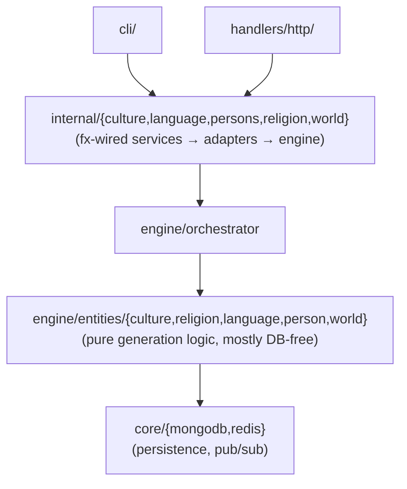

# Persons Generator

[](https://github.com/olehmushka/persons-generator/actions/workflows/ci.yml)
[](https://goreportcard.com/report/github.com/olehmushka/persons-generator)
[](go.mod)
[](https://github.com/olehmushka/persons-generator/releases)
[](https://pkg.go.dev/persons_generator)
[](LICENSE)

A procedural worldbuilding engine written in Go. It generates cultures, religions,
languages, and individual people — complete with phenotype presets, temperament,
family relationships, and a year-by-year population simulation (aging, marriage,
births, deaths) across a coordinate grid ("world").

## Contents

- [What it does](#what-it-does)
- [Architecture](#architecture)
- [Quick start (no infrastructure required)](#quick-start-no-infrastructure-required)
- [Full demo — one command](#full-demo--one-command)
- [Development](#development)
- [Known limitations](#known-limitations)
- [Contributing](#contributing)
- [License](#license)

## What it does

- **Cultures & religions**: generates culture trees rooted in configurable ancient/
  medieval "abstract cultures," and matching religions with doctrine, deities,
  clergy, taboos, rituals, and holy scripture traits.
- **Languages**: procedural word generation per culture, built from a library of
  ~40 real-world word-base sources (for flavor, not for translation).
- **People**: individual persons with phenotype (body/face/hair/size/skin),
  temperament, sexual orientation, and multi-generational family trees.
- **Worlds**: a coordinate grid of locations, each seeded with population, that
  can be simulated year-by-year — people age, marry, have children, and die.
- Exposed two ways: a one-shot **CLI** for quick generation, and a persistent
  **HTTP API** backed by MongoDB (storage) and Redis (async world-generation
  progress, via a pub/sub worker).

## Architecture



`engine/entities/*` holds the actual generation logic (pure, mostly DB-free) and
`engine/orchestrator` is the thin layer that also knows how to persist and read
that data back from MongoDB/Redis. `internal/*` is a ports-and-adapters layer on
top of the orchestrator, wired together with [uber-go/fx](https://github.com/uber-go/fx)
for dependency injection; `handlers/http` and `cli` are the two entrypoints.

## Quick start (no infrastructure required)

`generate_religion` runs entirely in memory — no MongoDB, Redis, or Docker needed:

```sh
go run main.go generate_religion
```

```
Religion (name=Pekolarinism)
Type=polytheism(monolatry)
Dominated gender=male(moderate)
...
```

## Full demo — one command

```sh
docker-compose up -d --build
curl localhost:8000/healthz
curl localhost:8000/api/worlds
```

This starts the whole stack — the app, MongoDB, and Redis — together. No manual
`.env` setup needed; `docker-compose.yml` passes the app's environment directly.

See [`postman_collection/persons-generator.postman_collection.json`](postman_collection/persons-generator.postman_collection.json)
for the full request/response catalogue.

Prefer running the app directly on the host instead of in a container?

```sh
cp .env.sample .env
docker-compose up -d pg-mongo redis
make run_http_server          # go run main.go http_server_run
```

## Development

```sh
make install       # go mod download
make test          # go test ./...
make test_coverage # go test -cover ./...
make lint          # golangci-lint run
make fmt           # go fmt ./...
make docker_build  # docker build -t persons-generator .
make docker_run    # docker run --rm -p 8000:8000 persons-generator
```

## Known limitations

- `World.seekPartners` re-scans the whole location grid for every unmarried
  person, every simulated year — fine for small worlds, not optimized for
  scale.
- Test coverage currently favors pure/leaf logic (generation algorithms,
  serialization) over handler- and orchestrator-level coverage.
- The person-generation phenotype presets (`engine/entities/person/*/presets`)
  use codename-based categories (terrain/biome names) rather than real-world
  demographic labels, by design.

## Contributing

See [CONTRIBUTING.md](CONTRIBUTING.md) for how to set up a dev environment, run
tests/lint, and submit a change. Please also read the
[Code of Conduct](CODE_OF_CONDUCT.md). Questions or ideas that aren't quite a bug
report? Use [Discussions](https://github.com/olehmushka/persons-generator/discussions).

## License

[GPL-3.0](LICENSE)
